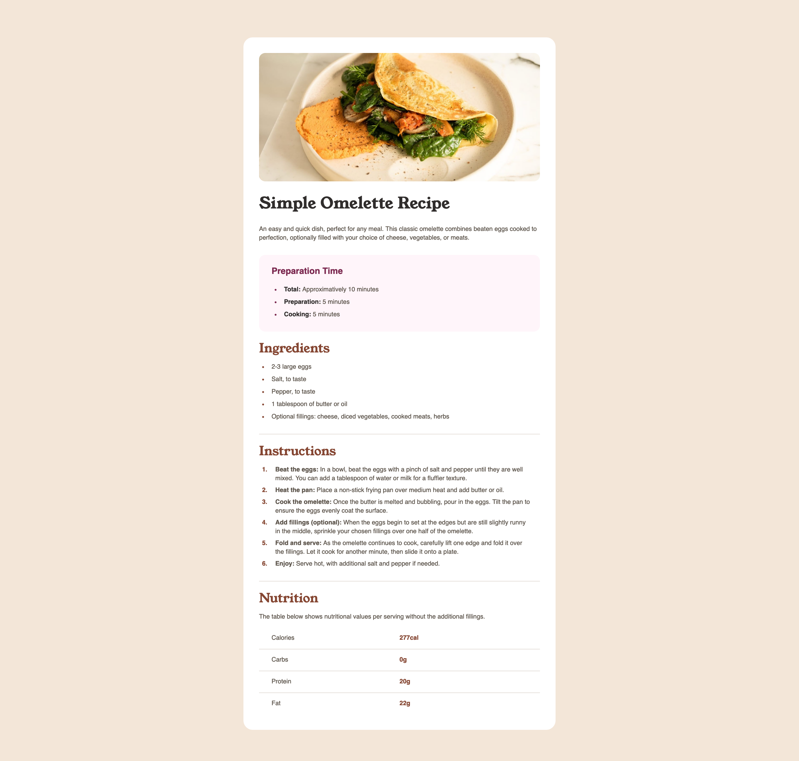
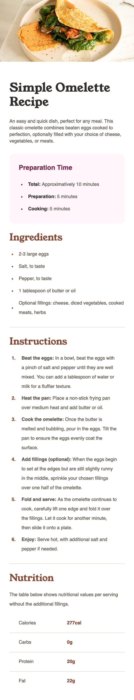

# Recipe Page

**Hi everyone 👋 !**

Ok, I admit...it took me one week to finish this project. Not because I didn't find any solution during this time, but because of my job 😅

Anyway, this is my solution for another [FrontendMentor](https://www.frontendmentor.io) challenge.

## Table of contents

- [Overview](#overview)
  - [The challenge](#the-challenge)
  - [Screenshots](#screenshots)
  - [Links](#links)
- [My process](#my-process)
  - [Built with](#built-with)
- [Author](#author)

## Overview

### The challenge

A recipe page ! This is what the project is about ! The link as usual : [Recipe Page project](https://www.frontendmentor.io/challenges/recipe-page-KiTsR8QQKm).

### Screenshots

This is my solution for **desktop screens**:

And this is for **mobile screens**:

### Links

- Live Site URL: https://musread.github.io/recipe-page/

## My process

### Built with

- Semantic HTML5 markup
- CSS custom properties
- Flexbox
- Node Modules

## Author

- GitHub - https://github.com/Musread
- Frontend Mentor - [@musread](https://www.frontendmentor.io/profile/musread)
